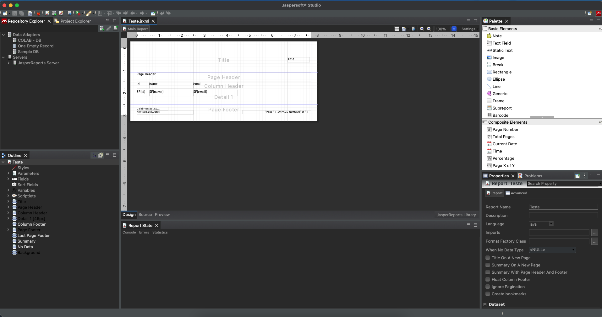
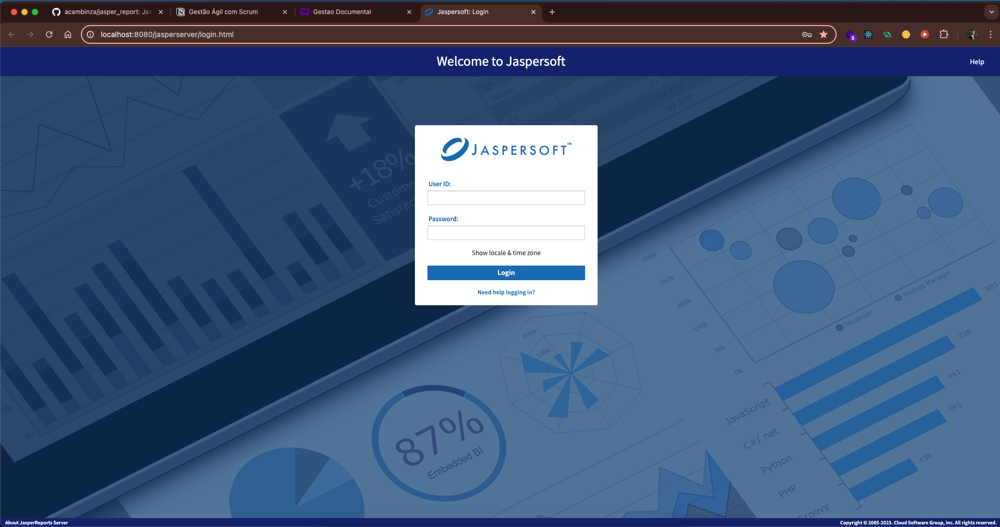
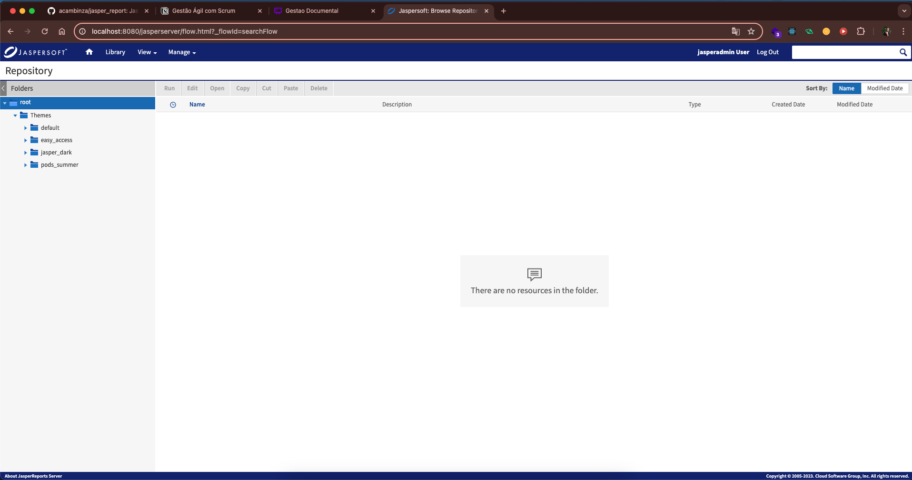

# Jasper Report
Jasper Studio, Jasper Server and Node JS Express

## Architecture Solution

# Descripion
- JasperReports

O JasperReports é uma poderosa ferramenta de geração de relatórios em Java, amplamente utilizada no desenvolvimento de aplicativos empresariais. Ele permite que os desenvolvedores criem relatórios sofisticados e dinâmicos, com recursos como gráficos, tabelas, imagens e formatação personalizada.

O JasperReports utiliza arquivos de definição XML para descrever o layout e os dados dos relatórios, e pode ser integrado facilmente a diversas tecnologias Java, como Spring, Hibernate e Java EE. Ele oferece suporte a uma variedade de formatos de saída, incluindo PDF, HTML, Excel, CSV e XML, permitindo que os relatórios sejam distribuídos e visualizados de várias maneiras.

Além disso, o JasperReports possui uma comunidade ativa de usuários e desenvolvedores, o que significa que há uma abundância de recursos, documentação e suporte disponíveis para ajudar no desenvolvimento e na personalização de relatórios.

## Jasper Studio 

O Jaspersoft Studio é uma ferramenta de design de relatórios baseada na plataforma Eclipse, que oferece uma interface gráfica intuitiva para criar e personalizar relatórios usando o JasperReports. Ele simplifica o processo de criação de relatórios, permitindo que os desenvolvedores arrastem e soltem elementos visuais, configurem propriedades e visualizem os resultados em tempo real.

Com o Jaspersoft Studio, os usuários podem criar relatórios complexos com facilidade, incluindo tabelas, gráficos, imagens, sub-relatórios e muito mais. Ele também oferece recursos avançados, como a capacidade de integrar consultas SQL, criar expressões personalizadas, aplicar formatação condicional e gerar relatórios parametrizados.

Além disso, o Jaspersoft Studio facilita a integração com outros sistemas e ferramentas, permitindo que os desenvolvedores exportem relatórios para uma variedade de formatos, como PDF, HTML, Excel e CSV, e os incorporem em aplicativos Java, web e móveis.

Em resumo, o Jaspersoft Studio é uma ferramenta essencial para desenvolvedores que precisam criar relatórios profissionais e personalizados em suas aplicações Java.

## Jasper Server

O JasperReports Server é uma plataforma de relatórios empresariais desenvolvida pela Jaspersoft, que permite aos usuários criar, distribuir e gerenciar relatórios de forma centralizada. É uma solução completa para empresas que precisam de recursos avançados de geração de relatórios, agendamento, segurança e integração com outros sistemas.

Através do JasperReports Server, os usuários podem criar e publicar relatórios interativos baseados na web, que podem ser acessados por meio de navegadores da web ou integrados a aplicativos existentes usando APIs RESTful. Ele oferece recursos de personalização avançados, permitindo que os administradores configurem permissões de acesso, personalizem a aparência da interface do usuário e gerenciem os recursos de relatórios de forma eficiente.

Além disso, o JasperReports Server suporta uma variedade de fontes de dados, incluindo bancos de dados relacionais, OLAP, arquivos XML, JSON, entre outros. Isso permite que as organizações consolidem dados de várias fontes e criem relatórios consolidados e analíticos para análise de negócios.

Outros recursos importantes do JasperReports Server incluem agendamento automatizado de relatórios, alertas por e-mail, exportação de relatórios para uma variedade de formatos, como PDF, Excel, HTML e CSV, e integração com LDAP e Single Sign-On (SSO) para autenticação de usuários.

No geral, o JasperReports Server é uma solução robusta para empresas que precisam de uma plataforma de relatórios escalável, flexível e altamente personalizável para atender às suas necessidades de geração de relatórios e análise de dados.

## Author
- Anselmo Cambinza
- acambinza@gmail.com